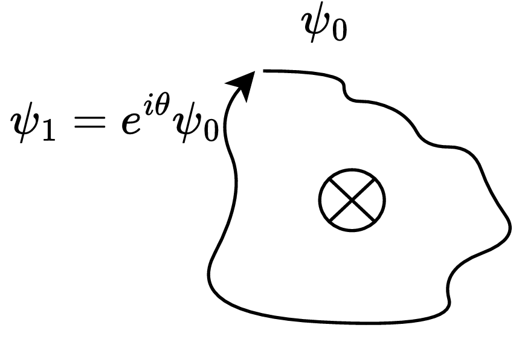
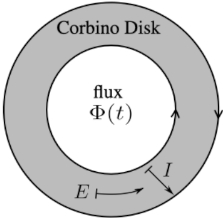

## Schrodinger's Equation of Hall Effect

当我们同时考虑电场和磁场时，磁场项会导致Landau levels，而电场项会导致Landau States的实空间中的平衡位置（谐振子）出现平移，进而导致垂直于电、磁场的群速度。这便是Hall Effect。

当我们考虑边界效应的时候，边界可以视为一个势垒，对其进行一级近似的时候，其作用类似于电场。因而也会导致一个垂直于电、磁场的电流。这个电流便是手性边界态。由于这个势垒在左、右的一级近似的符号相反，因而会导致相反的电流方向。手性是指，电流仅沿着某单一方向运动，其背散射被抑制（方向相反意味着该电子需要穿过整个体到达另外一个表面）。

手性异常：如果单独看某个界面态，其粒子数不守恒。仅当我们考虑体态及其泵浦效应（通过Hall 电流将某界面态的电子Pump到另一界面态中）时，粒子数才是守恒的。出现这种异常意味着，该体系仅仅是某个更大体系的边界态。

## AB相位

将Berry Phase中的状态空间修改为矢势空间，可以得到AB相位的形式。二者均为几何相位。当电子绝热地绕如图螺线管外侧一圈后，会相比初态获得一个相位：

其中，相位因子正比于磁通量：
$$
\theta = \frac{q\Phi}{\hbar}
$$

## Corbino Disc

现有一个圆环系统。圆环域用于模拟周期性晶格。中心空白处施加变化磁通，我们想模仿Hall effect的构型，利用这个含时磁通来构建一个沿着$x$轴方向的恒定电场。由Maxwell equations：
$$
\begin{align}
\oint\vec E\cdot\dd{\vec l} &= -\iint\frac{\partial \vec B}{\partial t}\cdot \dd{\vec a}\\
2\pi rE&=-\frac{\dd \Phi}{\dd t}
\end{align}
$$
可以令：
$$
\Phi=-2\pi r Et
$$

令$x$轴沿着切向($\hat \theta$)，$y$轴沿着径向($\hat r$)。，需要一个沿着$x$方向的矢势：
$$
\vec A=-Et\hat\theta
$$
取其旋量，得磁感应强度：
$$
\begin{align}
\nabla\times \vec A&=\frac{1}{r}\hat z(\partial_r(rA_\theta)-\partial_\theta A_r)\\
&=\frac{1}{r}\hat z(-Et)
\end{align}
$$
由此可得磁通为：
$$
\Phi = \iint \frac{1}{r}(-Et)r\dd\theta\dd r=-(2\pi r_0E)t
$$

