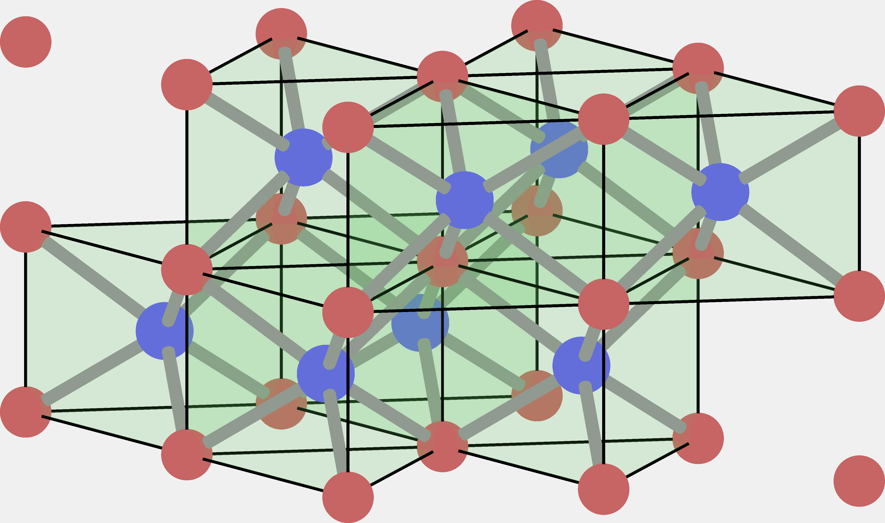

## 如何绘制简单的曲面

在绘制诸如tube、arrow、sphere等简单的几何图形，或一些稍微复杂的原子轨道（尤其是涉及球谐函数）时，我们通常会采用柱、球坐标的形式。下面给出在Matlab中建立曲线坐标系的思路。

### 柱坐标系

```matlab
function [x,y,z,R] = cylinderMeshgrid(fpz,zlim)
%fpz为函数句柄, R = f(phi,z)
    z1 = linspace(zlim(1),zlim(2),30);               
    phi1 = 0:pi/180:2*pi;
    [phi,z] = meshgrid(phi1,z1);
    sz = size(phi);
    R = nan(sz);
    for i = 1:sz(1)
        for j = 1:sz(2)            
            R(i,j) = fpz(phi(i,j),z(i,j));
        end
    end   
    x = R.*cos(phi);
    y = R.*sin(phi);
end
```

### 球坐标系

```matlab
function [x,y,z] = sphereMeshgrid(fpt)
%fpt为函数句柄, R = f(phi,theta)
    theta1 = 0:pi/180:pi;
    phi1 = 0:pi/180:2*pi;
    [phi,theta] = meshgrid(phi1,theta1);
    sz = size(phi);
    R = nan(sz);
    for i = 1:sz(1)
        for j = 1:sz(2)            
            R(i,j) = fpt(phi(i,j)+rottp(1),theta(i,j)+rottp(2));
        end
    end   
    x = R.*sin(theta).*cos(phi);
    y = R.*sin(theta).*sin(phi);
    z = R.*cos(theta);
end
```


## 如何旋转/平移生成的曲面

通过Meshgrid得到三组mgx, mgy和mgz矩阵（三组矩阵中，同一位置的元素便代表一个曲面上的点(x,y,z)），通过rotvec2mat3d函数将旋转矢量rotv转换为矩阵，对(xyz)坐标进行旋转，旋转后，再依次对各个坐标平移：

```Matlab
function [mgx,mgy,mgz] = rotTransMg(mgx,mgy,mgz,rotv,trans)
RM = rotvec2mat3d(rotv);
sz = size(mgx);
for j = 1:sz(1)
    for k = 1:sz(2)
        temp = RM*[mgx(j,k);mgy(j,k);mgz(j,k)];
        mgx(j,k) = temp(1) + trans(1);
        mgy(j,k) = temp(2) + trans(2);
        mgz(j,k) = temp(3) + trans(3);
    end
end
end
```


## 如何通过正格矢量生成一个原胞（PC）

原胞的顶点可以通过对正格矢进行组合操作得到。即，从3个格矢中挑出0，1，2，3个格矢，求和。得到的结果便是原胞的8个顶点：
$$
8=2^3=\sum_{j=1}^3\left(\matrix{3\\j}\right)
$$
再通过MPT工具箱绘制多面体即可：

````matlab
pp = Polyhedron('V',vtc); %vtc即原胞顶点，pp为多面体示例
plot(pp,'Color',[0,0,0],'alpha',0.5);
axis equal off %别忘了让三个坐标轴平权
````


## 如何将一个PC中的所有原子绘制出来

从相对原子坐标中，所有那些包含0的原子坐标（位于原胞的棱或顶点上），均是可以通过一个格矢的平移来生成一个位于原胞棱或顶点处的原子。如CrSb中，Cr的坐标是：
$$
\matrix{0&0&0\\0&0&0.5}
$$
可以预见，一个原胞内会出现的Cr原子数目为：
$$
2^2+2^3=12
$$
绘制原子的方法则很简单，只要采用球坐标，令R为常数即可。


## 如何扩胞

设置各个方向的上限[n1,n2,n3]，在上限的范围内遍历所有格矢，并将这些格矢加在某原子的相对坐标上，若原子坐标的各个分量均在上限之内，则将其保存在原子列表中。这种方法下，可以令上限为[1,1,1]，从而取代上一节的方法。

```matlab
function hv = expandCell(relr,lim)
%lim限定边界
hv = [];
vv = relr;
for i = 0:lim(1)
    for j = 0:lim(2)
        for k = 0:lim(3)
            if all((lim-vv-[i,j,k])>=0)
                hv = [hv;vv+[i,j,k]];
                vv = relr;
            else
                continue;
            end
        end
    end
end

end
```


## 如何绘制Bonds

绘制Bonds。输入值为(r1,r2)，令$\vec d = \vec r_2-\vec r_1$。首先在柱坐标系下绘制一个圆柱。圆柱的长度是$d$，圆柱的方向先沿着z轴，再旋转、平移到指定位置。

旋转矢量的方向为$\hat z\times \vec d/d$，大小为$\acos(\hat z\cdot \vec d/d)$。

```matlab
function drawBond(r1,r2)
vecd = r2 - r1;
d = norm(vecd);
hatd = vecd/d;
hatz = [0,0,1];
cv = cross(hatz,hatd);
rotv = cv.*acos(dot(hatz,hatd))./norm(cv);
f = @(p,z) 0.1;
[x,y,z] = cylinderMeshgrid(f,[0,d]);
[x,y,z] = rotMeshgrid(x,y,z,rotv);
[x,y,z] = transformMeshgrid(x,y,z,r1);
ss = surf(x,y,z, ...
    'edgecolor','none','facecolor',150*[1,1,1]/256);
end
```

当通过两个点可以生成一条Bond后，我们只需要选定两组坐标集，再确定一个Bond的最小和最大值，后面要做的就是两两遍历这些坐标集，将符合长度的那些原子用Bond连接起来。最好保存一个连接矩阵，用于后续绘制多面体。


## 如何绘制多面体

选取中心原子，并将上述连接矩阵的行代表中心原子，并给出顶角原子的位置矩阵。连接矩阵的同一行中，那些为1的元素对应的原子坐标可以组成一个poly的顶点。利用MPT工具箱可以将顶点绘制为多面体。每行都会有一个多面体，将所有这些多面体依次绘制出来即可。

```matlab
function drawPoly(conList,pos2)
%连接矩阵(中心原子为行), 位置2（顶角原子的位置）
%默认以行为中心
sz = size(conList);
for i = 1:sz(1)
    vtc = [];
    for j = 1:sz(2)
        if conList(i,j) == 1
            vtc = [vtc;pos2(j,:)];
        end
    end
    pp = Polyhedron('V',vtc);
    clr = [100,200,100]/256;
    plot(pp,'Color',clr,'alpha',0.1);
end

end
```



## 如何加高光特效

Matlab可以加光线效果，最多允许8个光源。

```matlab
camlight
light
lighting phong
material shiny
```


## 如何导出高清图片

如果直接使用Matlab的内置方法来导出图片，会得到十分粗糙的结果。这里建议采用export_fig的库来导出图片（需要在mathwork官网下载）：

```matlab
export_fig lattice_image.png -r1000 %r指分辨率
```


