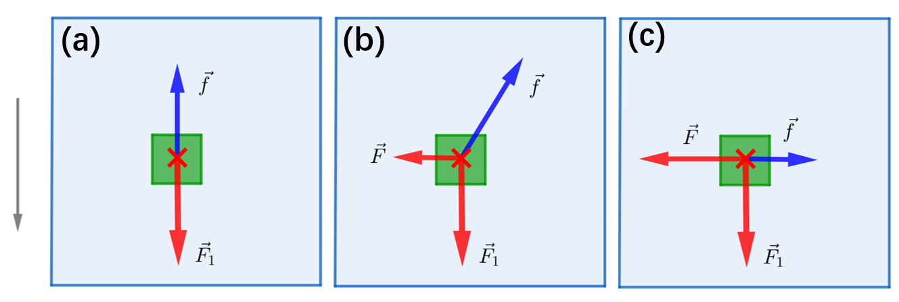
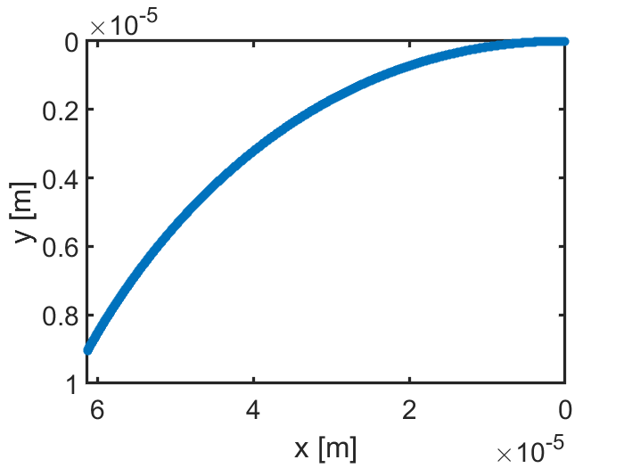

今有一问：一个物体在斜面上静止，此时向物体施加垂直于斜面坡度方向（垂直于纸面向内）的力$F$，物体将会如何运动？

## 定性分析：

1. 物体在静止状态时，受到沿斜面向下的力（$mg\sin\theta$）和与**相对运动趋势相反的静摩擦力**（相对运动趋势，即，以斜面作为参照系，除去静摩擦力以外的其他力的合力方向）
2. 物体在受到力$F$作用后，相对运动趋势改变，此时静摩擦力将会逆着$F$与$mg\sin\theta$的合力方向（静摩擦力），大小与这些力的合力相等。
3. 当$F$足够大时，物体开始运动。这个瞬间，静摩擦力变为**滑动摩擦力**，其方向将会**逆着物体运动方向**（而不是像静摩擦力那样，与其他力的合力方向相反）。其大小由其对斜面的正压力（$mg\cos\theta$）和二者之间的滑动摩擦因数（$\mu$）有关。



## 运动方程

更进一步，我们尝试求解这一运动的轨迹。取$x,y$轴沿着$F,F_1$方向，由经典力学运动方程：
$$
m\frac{\partial^2 \vec r}{\partial t^2}=F\hat x+F_1\hat y-\frac{f}{|v|}\frac{\partial \vec r}{\partial t}
$$
写成分量方程（正交分解）：
$$
\begin{align}
\frac{\text{d} v_x}{\text{d}t}+\frac{f}{\sqrt{v_x^2+v_y^2}}v_x=F/m\\
\frac{\text{d} v_y}{\text{d}t}+\frac{f}{\sqrt{v_x^2+v_y^2}}v_y=F_1/m\\
\end{align}
$$

## 数值求解

解析解很难求解，考虑数值求解：
$$
\frac{v_x(t_{n})-v_x(t_{n-1})}{\Delta t}+\frac{f}{v(t_n)}v_x(t_n)=F/m\\
\frac{v_y(t_{n})-v_y(t_{n-1})}{\Delta t}+\frac{f}{v(t_n)}v_y(t_n)=F_1/m\\
v(t_n) = \sqrt{v_x^2(t_n)+v_y^2(t_n)}
$$
化简为：
$$
v_x(t_{n+1})-v_x(t_{n})+\frac{f\Delta t}{v(t_n)}v_x(t_n)=F\Delta t/m\\
v_x(t_{n+1})=\left(1-\frac{f\Delta t}{v(t_n)}\right)v_x(t_n)+F\Delta t/m\\
$$
对于$y$分量，情况类似。初始条件为$v=0$。由以上递推公式可以求解$t_n$时刻的速度。下图展示了$1\; \text{ns}$ 的时间内，物块的运动轨迹。



以下是模拟代码：

```matlab
clear;clc;
theta = 20/180*pi;

m = 2;
g = 9.8;
mu = 0.7;

F = 10; %N
F1 = m*g*sin(theta);

para.f = mu*m*g*cos(theta);
para.delta = 0.0000000000001;
para.m = m;

vxn = 0.0000001;
vyn = 0;
vx_arr = [];
vy_arr = [];
for j = 1:100000
    vx_arr = [vx_arr,vxn];
    vy_arr = [vy_arr,vyn];
    %tn = j*para.delta;
    para.v = sqrt(vxn^2+vyn^2);
    para.F = F;
    vxn = vxnp1(vxn,para);
    para.F = F1;
    vyn = vxnp1(vyn,para);
end

rx = intarr(vx_arr);
ry = intarr(vy_arr);

ax = axes;
plot(ax,rx,ry,'*');
ax.XDir = 'reverse';
ax.YDir = 'reverse';
xlabel(ax,'x [m]');
ylabel(ax,'y [m]');
myAxStyle(ax);


%%
function rr = vxnp1(vxn,para)
    rr = (1-para.f*para.delta/(para.v))*vxn+para.F*para.delta/para.m;
end

%%
function rr = intarr(arr)
    rr = arr;
    for j = 1:length(arr)
        rr(j) = sum(arr(1:j));
    end
end
```


## 解析解尝试

首先，尝试求解齐次方程：
$$
\sqrt{1+(\frac{v_y}{v_x})^2}\text{d}v_x=-f\text{d}t\\
h(v_x/v_y)=-ft+C
$$
其中，
$$
h(x)=\sqrt{1+x^2}+\ln|x+\sqrt{1+x^2}|-1
$$
是超越函数，无法写出其逆函数的解析表达式，记其逆为$h^{-1}$，则：
$$
v_x = v_yh^{-1}(c_x-ft)\\
v_y = v_xh^{-1}(c_y-ft)
$$

$$
h^{-1}(c_x-ft)=\frac{1}{h^{-1}(c_y-ft)}\\
c_x=h(\frac{1}{h^{-1}(c_y-ft)})+ft
$$

$$
c_x=h(\frac{1}{h^{-1}(c_y)}),c_y=h(\frac{1}{h^{-1}(c_x)})
$$

$$
c_x=c_y=c
$$

$$
(c-ft)=h(\frac{1}{h^{-1}(c-ft)})
$$


$$
h(1/x)=\frac{1}{x}\sqrt{1+x^2}+\ln|1+\sqrt{1+x^2}|-\ln|x|-1\\
$$


求解不定积分：
$$
\begin{align}
\int\sqrt{1+(\frac{q}{x})^2}\text{d}x&=\int\frac{x^2}{x^2}\text{d}x\sqrt{1+(\frac{q}{x})^2}\\
&=-\frac{q^2}{q}\int (x/q)^2\text{d}\frac{q}{x}\sqrt{1+(\frac{q}{x})^2}\\
&=-{q}\int\text{d}t\frac{1}{t^2}\sqrt{1+t^2}\\
&=-q\int\text{d}\tan\theta\frac{\cos^2\theta}{\sin^2\theta}\frac{1}{\cos\theta}\\
&=-q\int\frac{1}{\sin^2\theta\cos\theta}\text{d}\theta\\
&=-q\int[\frac{1}{\cos\theta}+\frac{\cos\theta}{\sin^2\theta}]\text{d}\theta\\


\end{align}
$$
